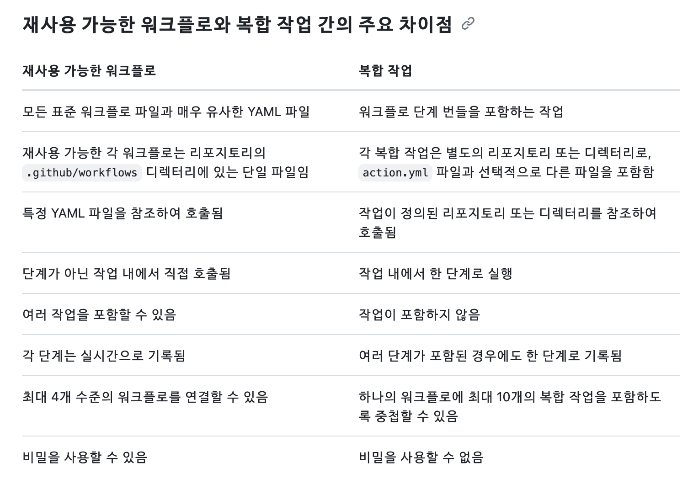

# 홈 서버 CD 테스트용 repo

---

## Docker

- `test-server.dockerfile` : 우리 서버를 dockerize 할 명령어들의 집합

```dockerfile
FROM openjdk:17

# dockerFile 의 work directory 설정
WORKDIR /web-application

# gradlew build 로 만들어진 `*.jar` 파일을 `/web-application/app.jar` 로 복사
# COPY 명령어 특성상 `*.jar` 파일 없으면 이미지 생성 실패
COPY ./build/libs/*.jar app.jar

# `openjdk:17` 이미지에 java 명령어 들어있으니까 `app.jar` 실행
ENTRYPOINT ["java", "-jar", "app.jar"]
```

> `CMD` vs `ENTRYPOINT` ? 
> - `CMD` : 이미지를 통해 컨테이너 생성 시, **실행할 default 명령어**
> - `ENTRYPOINT` : 이미지를 통해 컨테이너 생성 시, **반드시 실행할 명령어**


- `dockerfile` 을 통해 서버 docker image 를 생성 (dockerize)

```bash
$ docker build -t [이미지 이름]:[태그] -f [dockerFile 이름] [dockerFile 을 찾을 경로]
```

- 생성한 이미지를 docker hub 에 upload

```bash
# private repo 에 push 하기 위해 로그인. 둘중 아무거나
$ docker -u [유저 이름] -p [비밀번호]
$ echo [비밀번호] | docker login -u [유저 이름] --password-stdin

# 이미지 push 하려면 이미지 이름을 [유저 이름]/[repo 이름]:[tag] 형식으로 바꿔줘야 함
# `tag` 또는 `image tag` 명령어로 새로운 image 를 만듬
# 공식 문서에도 이 둘은 차이 없다고 함 (alias)
$ docker tag [이미지 이름]:[tag] [유저 이름]/[repo 이름]:[tag]
$ docker image tag [이미지 이름]:[tag] [유저 이름]/[repo 이름]:[tag]

# [유저 이름]/[repo 이름]:[tag] (이름 바꿔 만든 image 이름 그대로) 이미지를 push
$ docker push [유저 이름]/[repo 이름]:[tag]
```

- docker hub 에 올라간 이미지를 pull

```bash
$ docker pull [유저 이름]/[repo 이름]:[tag]
```

- container 실행

```bash
$ docker run -d -p 8080:8080 \ 
> -e SPRING_PROFILES_ACTIVE=local-docker \ 
> --name [container 이름] [이미지 이름]:[tag]
```

이 때 `-e SPRING_PROFILES_ACTIVE=...` 로 실행할 spring profile 을 제공

`-d` 옵션은 컨테이너 background 로 돌리고 container ID 출력하는 옵션

`:[tag]` 생략시 `:latest` 붙은 이미지를 찾아 돌림.

- container, image 정지 or 삭제

```bash
# container 정지
$ docker stop [컨테이너 이름]

# 사용하지 않는 container 들 삭제
$ docker container prune -f

# 사용하지 않는 / container 로 사용하지 않는 image 들 삭제
$ docker image prune -af
```

`-f` 옵션은 `삭제 Y/N` 안 묻고 삭제하는 옵션

---

## GitHub Action

Github workflow 에는 `Composite Action`, `Reusable Workflow` 라는게 있다.

- [Creating a composite action](https://docs.github.com/en/actions/sharing-automations/creating-actions/creating-a-composite-action)
- [Reusing workflows](https://docs.github.com/en/actions/sharing-automations/reusing-workflows)

이들은 workflow 의 "중복" 을 없애기 위한 것으로, 쉽게 말해 함수 호출하듯이 `workflow 에서 workflow 를 호출` 하기 위한 것이라 할 수 있다.

이 둘은 비슷해 보이지만 한가지 큰 차이점이 있는데, `"job 의 생성"` 이다.

Composite Action 을 호출하는 것은 `"현재 수행하는 job 에서 어느 Step 을 호출"` 한 것과 같아, **"동일한 runner (machine)"** 에서 실행된다.

반면 Reusable Workflow 를 호출하는 건 `"또다른 job 을 호출"` 한 것과 같아, **"또다른 runner"** 에서 작업이 수행된다.

공식 문서에서도 이 둘의 차이를 명시해 보여주고 있다.

- [Avoiding duplication](https://docs.github.com/en/actions/sharing-automations/avoiding-duplication#key-differences-between-reusable-workflows-and-composite-actions)

<p align="center">
    
</p>

이 두가지가 아주 비슷하다 보니 어떤걸 사용해야 될 지 고민되었고, 그냥 `"다른 runner 에서 돌아가야 하는지"` 를 기준으로 삼아 분리했다.

---

### Composite Actions

#### 1. `build-application`

우리 앱을 build 시키기 위한 Composite Action 이다. `JDK 셋업`, `gradlew build` 를 진행한다.

`build-application` 은 3 가지 `inputs` 를 필요로 한다.
- `working_dir` : gradlew 가 존재하는 directory
- `java_version` : JDK 버전
- `distribution` : JDK 벤더

기본값은 각각 `./`, `17`, `temurin` (Eclipse 벤더) 이다.

세부적으로 다음의 작업을 순차적으로 진행한다.
- `working_dir` 에 `gradlew` 가 존재하는지 확인
- `gradlew` permission 변경 (executable)
- gradle build 캐시 진행
- JDK 셋업
- (gradle build 캐시 없으면) `gradlew build -x test` 실행

`build-application` 는 이름 그대로 빌드만 시켜주기 때문에, 사용 이전에 `actions/checkout`, `숨겨진 profile 추가` 를 진행해줘야 한다.

<details><summary>action.yml</summary>

```yml
# .github/workflows/composite/utils/build-application/action.yml
name: Build application

description: 'Setup JDK 17 & build application via gradle.'

inputs:
  working_dir:
    required: true
    default: './'
    description: 'A directory where gradlew exists'

  java_version:
    required: true
    default: 17
    description: 'JDK version'

  distribution:
    required: true
    default: 'temurin'
    description: 'JDK distribution'

runs:
  using: composite

  steps:
    - name: Check whether gradlew exists
      shell: bash
      run: |
        if [ ! -f ${{ inputs.working_dir }}gradlew ]; then
          echo "No gradlew exists on working directory ${{ inputs.working_dir }}"
          exit 1
        fi

    - name: Change gradlew permission
      shell: bash
      run: chmod +x ${{ inputs.working_dir }}gradlew

    - name: Cache gradle
      uses: actions/cache@v4
      id: cache-gradle
      with:
        path: |
          ~/.gradle/caches
          ~/.gradle/wrapper
        key: ${{ runner.os }}-gradle-${{ hashFiles('**/*.gradle*', '**/gradle-wrapper.properties') }}
        restore-keys: ${{ runner.os }}-gradle-

    - name: Setup JDK
      uses: actions/setup-java@v4
      with:
        java-version: ${{ inputs.java_version }}
        distribution: ${{ inputs.distribution }}

    - name: Build if no gradle cache found
      if: steps.cache-gradle.outputs.cache-hit != 'true'
      shell: bash
      run: |
        echo "No gradle found via cache. Running gradlew build..."
        ${{ inputs.working_dir }}gradlew build -x test

```

</details>

---

#### 2. `save-given-to-file`

`save-given-to-file` 는 주어진 `context` 를 파일로 저장하는 Composite Action 이다.

우리 Repo secret 에 저장된 spring profile 들을 `resource` 폴더에 저장하기 위해 만들었다.

`save-given-to-file` 는 3 가지 `inputs` 를 필요로 한다.
- `context` : 저장할 내용
- `file_dir` : 저장될 위치 (directory)
- `file_name` : 저장될 이름 (name)

아래처럼 `save-given-to-file` 를 사용할 수 있다.

```yaml
name: test `create profiles` on pr

on:
  pull_request:
    branches:
      - main
      - develop

jobs:
  test:
    runs-on: ubuntu-latest

    steps:
      - name: Checkout repository
        uses: actions/checkout@v4

      - name: Create application-test-profile.properties from secret
        uses: ./.github/workflows/composite/utils/save-given-to-file
        with:
          # Repo secret 에 저장된 profile 을 넘겨줌
          context: ${{ secrets.TEST_PROFILE_CONTEXT }}  
          file_dir: './src/main/resources'    # 저장될 directory
          file_name: 'application-test-profile.properties'  # 저장될 이름

# ... 생략 ... #
```

참고로 **`actions/checkout` 을 다시 실행 하면 `save-given-to-file` 로 저장된 내용이 모두 날아간다.**

그래서 `actions/checkout` 은 workflow 시작 시에만 사용하는 것이 좋다. 


<details><summary>action.yml</summary>

```yaml
# .github/workflows/composite/utils/save-given-to-file/action.yml
name: Save given context to local

description: 'Save given context to local. It will be saved as [ file_dir/file_name ]'

inputs:
  context:
    required: true
    description: 'A context to save as file'

  file_dir:
    required: true
    description: 'A directory to store secret file'

  file_name:
    required: true
    description: 'A name of a secret file'

runs:
  using: 'composite'

  steps:
    - name: Check whether duplicate exists
      shell: bash
      run: |
        if [ -f "${{ inputs.file_dir }}/${{ inputs.file_name }}" ]; then
          exit 1
        fi

    - name: Save given to destination
      shell: bash
      run: |
        mkdir -p "${{ inputs.file_dir }}"
        echo "${{ inputs.context }}" > "${{ inputs.file_dir }}/${{ inputs.file_name }}"

```

</details>

---

### Reusable Workflows

잉 귀찮아 [블로그 참조](https://velog.io/@jbw9964/Habit-Home-server-%EA%B5%AC%EC%B6%95%EA%B8%B0-5-CD-%ED%8C%8C%EC%9D%B4%ED%94%84%EB%9D%BC%EC%9D%B8-%EA%B5%AC%EC%B6%95#reusable-workflows)

---

## Spring Profiles

Profile 을 3 개로 분리. `database`, `monitoring`, `[실행 위치]`

`[실행 위치]` 는 `local`, `local-docker`, `prod-test` 등 `실배포`/`테스트 배포`/`개발` 에 따라 변경하느 profile.

그래서 `[실행 위치]` profile 에는 `database`, `monitoring` 에 필요한 값들을 설정하는 모습으로 만듬.

```properties
# application-database.properties
spring.datasource.url=jdbc:mysql://${db-host:localhost}:3306/${db-name}
spring.datasource.username=${db-username}
spring.datasource.password=${db-password}
spring.jpa.properties.hibernate.dialect=${db-dialect}
spring.jpa.hibernate.ddl-auto=${db-ddl}
```
```properties
# application-local.properties
db-host=localhost
db-name=local-test-db
db-username=root
db-password=root
db-dialect=org.hibernate.dialect.MySQLDialect
db-ddl=update
```

`local` profile 이 `db-host`, `db-username` 같은걸 설정해 `database` profile 에 사용하는 것을 볼 수 있음.

`monitoring` 은 환경별 설정할게 없어서 생략.

기본 `application.properties` 는 아래처럼 구성

```properties
# application.properties
spring.application.name=test-server
management.server.port=8080

spring.profiles.group.essential=database,monitoring
spring.profiles.include=essential

spring.profiles.active=local
```

위 `spring.profiles.active=local` 이 있는데, 이는 `docker run ...` 시 `-e SPRING_PROFILES_ACTIVE=...` 명령어로 **overload** 할 수 있음.

`-e SPRING_PROFILES_ACTIVE=local-docker` 로 하면 아래처럼 돌리는 것과 동일.

```properties
spring.application.name=test-server
management.server.port=8080

spring.profiles.group.essential=database,monitoring
spring.profiles.include=essential

spring.profiles.active=local-docker
```

참고로 지금 테스트 서버에 `앱은 docker`, `MySQL 은 local` 로 돌아가고 있음.
그래서 `docker <---> local MySQL` 처럼 DB 통신해야 됨.

문제는 **앱이 docker 로 돌아갈 때 local 과 통신** 하는 방식임.

결론적으로 만약 서버가 Window, MacOS 같은 거면 `DB Host` 를 아래처럼 넣으면 됨.

```properties
db-host=host.docker.internal
```

근데 만약 Linux 면 아래처럼 해야됨

```properties
db-host=172.17.0.1
```

`172.17.0.1` 가 docker default gateway 기본 주소인가 뭔가 그렇다나봄.
결론은 OS 에 따라 저거 달라져야 됨.

뭔가 통일되게 하는 방법은 몰???루???

---

